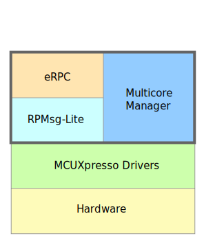
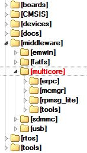

# Getting Started with Multicore SDK (MCSDK)

## Overview

The **Multicore Software Development Kit (MCSDK)** provides software components for NXP dual/multicore devices. The MCSDK is combined with the MCUXpresso SDK to provide a framework for developing multicore applications.

All MCSDK-related files are located in:

- `<MCUXpressoSDK_install_dir>/middleware/multicore/`

For supported toolchain versions, see the release notes.

## Quick links

- [MCSDK Release Notes](../MCSDK_ReleaseNotes/mcsdk_releasenotes.md)
- [MCSDK Changelog](../../CHANGELOG.md)
- Component repositories (within MCSDK):
  - [RPMSG-Lite](../../rpmsg-lite/README.md)
  - [Multicore Manager (MCMGR)](../../mcmgr/README.md)
  - [eRPC](../../erpc/README.md)
- eRPC detailed Getting Started guide:
  - [eRPC Getting Started](../eRPC_GettingStarted/ugindex.md)

## MCSDK components

The MCSDK consists of the following components:

- **Embedded Remote Procedure Call (eRPC):** Library + code generator implementing transparent function calls to services running on another core.
- **Multicore Manager (MCMGR):** Core management services (start/stop secondary cores, events, monitoring).
- **Remote Processor Messaging – Lite (RPMSG-Lite):** Lightweight inter-processor messaging library based on RPMsg.

### Where things live

| Item | Path |
|---|---|
| MCSDK root | `<MCUXpressoSDK_install_dir>/middleware/multicore/` |
| eRPC | `<MCUXpressoSDK_install_dir>/middleware/multicore/erpc/` |
| MCMGR | `<MCUXpressoSDK_install_dir>/middleware/multicore/mcmgr/` |
| RPMSG-Lite | `<MCUXpressoSDK_install_dir>/middleware/multicore/rpmsg-lite/` |
| MCSDK documentation | `<MCUXpressoSDK_install_dir>/middleware/multicore/mcuxsdk-doc/` |
| Multicore examples | `<MCUXpressoSDK_install_dir>/examples/multicore_examples/` |

## MCSDK demo applications

Multicore example applications are stored together with other MCUXpresso SDK examples.

| Location | Folder |
|---|---|
| Multicore example projects | `<MCUXpressoSDK_install_dir>/examples/multicore_examples/<application_name>/` |

Each example application contains a README describing setup, required images, and runtime behavior.

## Inter-Processor Communication (IPC) levels

The MCSDK provides several mechanisms for Inter-Processor Communication (IPC). Pick the lightest one that matches your requirements.

### IPC using low-level drivers

NXP multicore SoCs commonly provide dedicated IPC peripherals (Mailbox for some LPC parts, Messaging Unit (MU) for some Kinetis and i.MX parts).

This is the most lightweight approach: using the Mailbox/MU driver API functions, it is possible to pass a value from core to core via registers (scalar or pointer to shared memory) and trigger inter-core interrupts for notifications.

For details about individual driver API functions, see the MCUXpresso SDK API Reference Manual of the specific device.

### Messaging mechanism (RPMSG-Lite)

On top of Mailbox/MU drivers, a messaging system can be implemented, allowing messages to be sent between endpoints created on each CPU.

RPMSG-Lite provides this capability and is the preferred MCUXpresso SDK messaging library. It implements ring buffers in shared memory for message exchange.

This costs additional code and data memory, but provides a unified messaging API and helps portability across devices/RTOSes.

### Remote procedure calls (eRPC)

To facilitate IPC further, eRPC allows remote function invocation via a simple local function call.

Using different transport layers, it can communicate:

- between individual cores of multicore SoCs (commonly via RPMSG-Lite)
- between separate processors (SPI, UART, TCP/IP)

If the communicating peer is a Linux user-space application, the generated code can be in C/C++ or Python.

The IPC levels demonstrate the scalability of the MCSDK. Based on application needs, different IPC techniques can be used depending on complexity, speed, memory, and system design.
