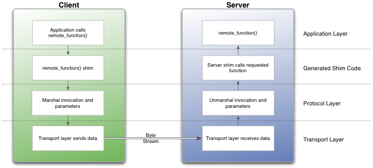

# Embedded Remote Procedure Call \(eRPC\)

The Embedded Remote Procedure Call \(eRPC\) is the RPC system created by NXP. The RPC is a mechanism used to invoke a software routine on a remote system via a simple local function call.

When a remote function is called by the client, the function's parameters and an identifier for the called routine are marshaled \(or serialized\) into a stream of bytes. This byte stream is transported to the server through a communications channel \(IPC, TPC/IP, UART, and so on\). The server unmarshaled the parameters, determines which function was invoked, and calls it. If the function returns a value, it is marshaled and sent back to the client.

|

|

RPC implementations typically use a combination of a tool \(erpcgen\) and IDL \(interface definition language\) file to generate source code to handle the details of marshaling a function's parameters and building the data stream.

**Main eRPC features:**

-   Scalable from BareMetal to Linux OS - configurable memory and threading policies.
-   Focus on embedded systems - intrinsic support for C, modular, and lightweight implementation.
-   Abstracted transport interface - RPMsg is the primary transport for multicore, UART, or SPI-based solutions can be used for multichip.

The eRPC library is located in the *<MCUXpressoSDK\_install\_dir\>/middleware/multicore/erpc* folder. For detailed information about the eRPC, see the documentation available in the *<MCUXpressoSDK\_install\_dir\>/middleware/multicore/erpc/doc*folder.

**Parent topic:**[Multicore SDK \(MCSDK\) components](../topics/multicore_sdk_mcsdk_components.md)

