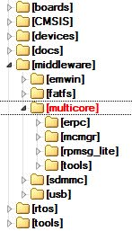

# Multicore SDK \(MCSDK\) components

The MCSDK consists of the following software components:

-   **Embedded Remote Procedure Call \(eRPC\):** This component is a combination of a library and code generator tool that implements a transparent function call interface to remote services \(running on a different core\).
-   **Multicore Manager \(MCMGR\):** This library maintains information about all cores and starts up secondary/auxiliary cores.
-   **Remote Processor Messaging - Lite \(RPMsg-Lite\):** Inter-Processor Communication library.

|

|


```{include} ../topics/embedded_remote_procedure_call_erpc.md
:heading-offset: 1
```

```{include} ../topics/multicore_manager_mcmgr.md
:heading-offset: 1
```

```{include} ../topics/remote_processor_messaging_lite_rpmsg-lite.md
:heading-offset: 1
```

