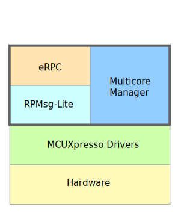

# Overview

Multicore Software Development Kit \(MCSDK\) is a Software Development Kit that provides comprehensive software support for NXP dual/multicore devices. The MCSDK is combined with the MCUXpresso SDK to make the software framework for easy development of multicore applications.

The following figure highlights the layers and main software components of the MCSDK.

|

|

All the MCSDK-related files are located in *<MCUXpressoSDK\_install\_dir\>/middleware/multicore* folder.

For supported toolchain versions, see the *Multicore SDK v.2.16.0 Release Notes* \(document MCSDKRN\). For the latest version of this and other MCSDK documents, visit [www.nxp.com](http://www.nxp.com).

